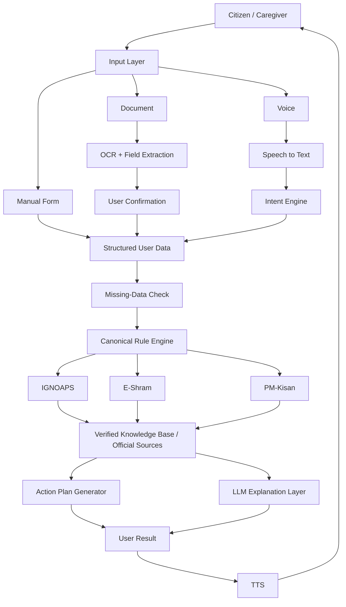
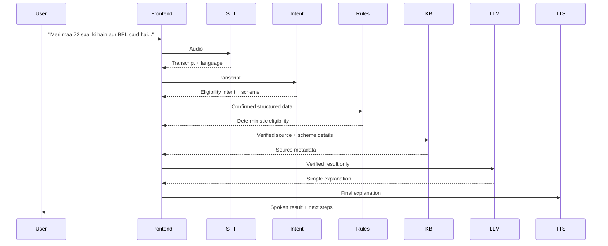

# Digital Saarthi — Repository Overview & Re-Engineering Review

> **Review date:** 25 September 2026  
> **Branch reviewed:** `main`  
> **Review method:** repository-wide static inspection of source, tests, documentation, project structure, and API contracts.  
> **Important:** this review does **not** claim that the full test suite was independently executed. The repository contains 358 test functions by static count.

---

## 1. Executive Summary

Digital Saarthi is an accessibility-first government-scheme eligibility assistant for elderly and low-literacy users. The repository contains a comparatively rich architecture: FastAPI, deterministic eligibility rules, OCR, speech-to-text, text-to-speech, intent detection, LLM explanation, action-plan generation, caching, security validation, accessibility checks, and a sizeable automated test suite.

The strongest part of the current codebase is the **policy/rule layer and component architecture**. The weakest part is **runtime integration**: the current `main.py` is not synchronized with the rest of the repository, several documented APIs are missing, and the voice/document endpoints are currently simplified/stub implementations.

### Current assessment

| Dimension | Current view |
|---|---:|
| Architecture / design maturity | **~70/100** |
| Runtime / integration readiness | **~50/100** |
| Combined engineering audit | **49/100** |
| Product concept maturity | **High** |
| Hackathon demo readiness | **Needs a focused integration pass** |

This is not a judgement on the competition outcome. It is an engineering assessment of the repository as it currently exists.

---

## 2. Product in One Sentence

**Digital Saarthi converts voice, document, or manual user input into a verified, explainable government-scheme eligibility result and actionable next steps, while keeping the deterministic rule engine in control of eligibility decisions.**

---

## 3. Current System Architecture

### Intended architecture



### Actual current HTTP integration

The repository does **not yet fully realize the above architecture in the live FastAPI entry point**.

```mermaid
flowchart LR
    FE[Frontend] --> API[Current FastAPI main.py]
    API --> CHECK[/api/check-all-schemes]
    API --> DOC[/api/scan-document]
    API --> VOICE[/api/voice-upload]

    CHECK --> SR[scheme_rules.py]
    DOC --> STUB1[Simplified response]
    VOICE --> STUB2["placeholder response"]

    ORPHAN[STT / OCR / LLM / TTS / Action Plan / IntegrationService] -. implemented but not fully wired .-> API
```

**Primary architectural objective:** make the runtime path match the intended architecture before adding new technologies.

---

## 4. Repository Structure

```text
digital-saarthi-app/
├── backend/
│   ├── app/
│   │   ├── main.py
│   │   ├── models.py
│   │   ├── rule_engine.py
│   │   ├── scheme_rules.py
│   │   ├── integration_service.py
│   │   ├── intent_engine.py
│   │   ├── knowledge_base.py
│   │   ├── retrieval.py
│   │   ├── stt_service.py
│   │   ├── ocr_service.py
│   │   ├── llm_service.py
│   │   ├── tts_service.py
│   │   ├── action_plan_generator.py
│   │   ├── cache_service.py
│   │   ├── security_validator.py
│   │   ├── rate_limit_middleware.py
│   │   ├── error_handler.py
│   │   └── accessibility_validator.py
│   ├── tests/
│   └── requirements.txt
├── frontend/
│   └── index.html
└── documentation / reports
```

The repository also contains committed Python `__pycache__` / `.pyc` artifacts, which should be removed from source control.

---

# 5. Software Architect Review

## What is working well

### Separation of concerns

The repository has clear service boundaries for:

- policy/rules
- intent detection
- retrieval
- OCR
- STT
- TTS
- LLM explanation
- action plans
- caching
- security
- accessibility
- orchestration

That is a sensible decomposition for a hackathon prototype.

### Good safety boundary

The intended architecture correctly separates:

```text
Government policy + deterministic rules
            ↓
      Eligibility decision
            ↓
      LLM explanation only
```

The LLM should explain verified decisions, not create the eligibility decision.

### Canonical policy direction

`scheme_rules.py` has improved considerably. E-Shram no longer applies the old annual-income cutoff, and PM-Kisan is no longer modeled with the obsolete 2-hectare cap.

## Architectural weaknesses

### A. Application initialization is duplicated

The current `main.py` creates a FastAPI app and later creates another `FastAPI(...)` object. This can discard middleware/configuration attached to the first instance.

**Action:** create exactly one application instance.

### B. The orchestrator is not the actual API backbone

`IntegrationService` exists, but `main.py` mostly performs its own orchestration. This creates two possible architectures.

**Target:**

```text
main.py
   ↓
IntegrationService
   ↓
services + canonical rules
```

### C. Multiple policy paths

There is still potential duplication among:

- `rule_engine.py`
- `scheme_rules.py`
- `integration_service.py`
- API endpoint transformations

**Target:** policy is defined once; other layers consume it.

### D. Scalability is acceptable for the prototype

The current in-process cache and IP rate limiter are fine for a local/demo deployment. They should not be described as horizontally scalable infrastructure.

For the October 24-hour hackathon, do **not** make distributed infrastructure the priority.

---

# 6. Software Developer Review

## Strong points

- Pydantic models provide explicit API contracts.
- Error-handling utilities exist.
- Security validation exists as reusable code.
- OCR and STT have meaningful preprocessing/validation logic.
- Intent detection supports Hindi/English-oriented keywords.
- Action-plan generation is relatively detailed.
- Tests cover many individual modules.
- The code is readable enough to continue refactoring.

## Critical implementation issues

### P0: Missing API routes

The current `main.py` exposes only a small subset of the API expected elsewhere in the repository.

Current routes include:

- `GET /`
- `POST /api/check-all-schemes`
- `POST /api/scan-document`
- `POST /api/voice-upload`

The tests/documentation also expect routes such as:

- `GET /health`
- `GET /api/schemes`
- `GET /api/schemes/{scheme_id}`
- `POST /api/check-eligibility`
- `POST /api/voice-query`
- `POST /api/confirm-document`

**Action:** define one final API contract and update backend, frontend, tests, and documentation to that contract.

### P0: OCR endpoint is simplified

The current document endpoint validates the upload and then returns a simplified response rather than invoking the OCR pipeline.

**Action:** call `process_document_bytes(...)`, return its extracted fields, and preserve `needs_confirmation=True`.

### P0: Voice endpoint returns placeholder data

The current voice endpoint returns a placeholder response instead of calling `transcribe_audio(...)`.

**Action:** wire the real STT service and then call the intent engine.

### P0: Rate-limit middleware response bug

The middleware returns an `HTTPException` object instead of returning a proper HTTP response or raising the exception.

**Action:** correct middleware behavior and add an HTTP-level test for 429.

### P1: Unknown versus false

Eligibility inputs such as BPL and farmer status need three states:

```text
None  = unknown / not supplied
True  = confirmed yes
False = confirmed no
```

Do not use `False` as the default for missing eligibility facts.

### P1: Response-model synchronization

Ensure every field constructed by the API exists in the Pydantic response model, including action-plan fields.

### P1: Browser audio MIME mismatch

The frontend labels a browser-recorded Blob as WAV even though the browser may produce another codec/container.

**Action:** use the actual `MediaRecorder.mimeType` and send a matching filename/content type.

### P1: Duplicate cache method

`cache_service.py` contains repeated `get_cached_response` definitions. Keep one implementation.

### P1: Cache metric is placeholder data

`cache_hit_rate: 0.73` is not a real measurement.

**Action:** track hits/misses or remove the metric.

---

# 7. Product Manager Review

## Product strengths

### Clear target audience

The product is aimed at people who often face a high-friction government-service workflow:

- elderly users
- low-literacy users
- caregivers/helpers
- Hindi/English users

### Strong problem → feature alignment

| User problem | Product response |
|---|---|
| Difficult websites/forms | Guided workflow |
| Low literacy | Simple language |
| Language barrier | Hindi + English |
| Typing difficulty | Voice |
| Repeated document entry | OCR |
| Confusing eligibility rules | Deterministic explanation |
| "What do I do next?" | Action plans |
| Fear of incorrect advice | Official sources + rule engine |

This is a stronger product story than "an AI chatbot for schemes."

## Product weaknesses

### A. The core user journey is not fully executable

The product promise is:

```text
Speak / Scan
     ↓
Understand
     ↓
Check
     ↓
Explain
     ↓
Act
```

At the moment, the complete chain is not consistently live.

### B. Too many features for a 24-hour narrative

Do not make the presentation about every service class.

Make the product story about one complete, reliable journey.

### C. "Offline" must be defined precisely

A local frontend/cache is not the same thing as full offline AI/STT/LLM operation.

Use precise language such as:

> "The application can retain static scheme information locally and degrade gracefully when network-dependent AI services are unavailable."

Only claim true offline AI once it has actually been implemented and tested.

---

# 8. Recommended Priority Queue

## P0 — Must fix before the online round / submission build

1. **Clean `main.py` and keep one FastAPI app.**
2. **Restore the complete final API contract.**
3. **Wire real OCR.**
4. **Wire real STT.**
5. **Wire the canonical rule engine.**
6. **Wire document confirmation.**
7. **Make unknown fields explicit.**
8. **Fix rate-limit middleware.**
9. **Make the frontend call only the final API routes.**
10. **Run the complete test suite and repair failures.**

## P1 — Do immediately after P0

11. Add one true end-to-end voice test.
12. Add one true end-to-end document → confirmation → eligibility test.
13. Add source cards to the actual API response.
14. Wire action-plan generation into the real response.
15. Keep LLM explanation optional, with deterministic fallback.
16. Add actual security-header tests.
17. Run an actual browser accessibility audit.
18. Remove stale docs/claims and `__pycache__`.

## P2 — After the core works

19. Improve retrieval beyond keyword matching.
20. Add more languages.
21. Add more schemes.
22. Add persistent/distributed infrastructure only when the product actually needs it.

---

# 9. Golden User Flow

This should be the canonical demo and the canonical integration test.



### Deliberate failure test

Also demonstrate:

> "Exactly how much money will I definitely receive every month?"

The system should refuse to invent an exact universal amount when the verified data does not support one, and instead show the source/verification note.

This proves the safety architecture instead of merely describing it.

---

# 10. 48-Hour Plan Before the Online Round

## 25 September — Integration day

**Do not start another major feature.**

Finish:

- clean `main.py`
- final API routes
- real OCR endpoint
- real STT endpoint
- rule engine integration
- confirmation flow
- frontend API cleanup

Then run:

```bash
pytest tests/ -v
pytest --cov=app --cov-report=term-missing
```

Record the **actual** results.

## 26 September — Verification + online-round preparation

Morning:

- fix all failing tests
- run the app from a clean environment
- test the frontend manually
- perform one full voice flow
- perform one full document flow
- test bad input deliberately

Afternoon/evening:

- freeze the code
- prepare a 60–90 second product explanation
- rehearse the architecture
- rehearse why deterministic rules are used instead of letting the LLM decide eligibility
- revise Python/FastAPI/API/AI fundamentals relevant to your implementation
- prepare a concise explanation of OCR, STT, intent detection, rule engine, RAG/retrieval, and privacy

## 27 September — Online round

For the online assessment, prioritize **clarity and accuracy over last-minute coding changes**.

Before the assessment:

- verify the final commit
- verify the app starts
- keep one known-good demo dataset ready
- do not push risky refactors immediately before the round

The objective is to leave the round with a stable codebase, not a larger codebase.

---

# 11. Questions the Team Should Answer

Before calling the project "finished", the team should be able to answer these without opening the code:

### Architecture

1. Which component is the **single source of truth** for eligibility?
2. Why is the LLM not allowed to decide eligibility?
3. What happens when OCR is wrong?
4. What happens when STT is uncertain?
5. What happens when required data is missing?
6. What still works when the network is unavailable?

### Product

7. Who is the primary user: citizen, caregiver, CSC operator, or all three?
8. What is the one task the user must complete successfully?
9. How does the product prevent users from treating its answer as an official government approval?
10. What is the measurable user benefit: fewer steps, less reading, lower confusion, or faster eligibility discovery?

### Engineering

11. Can a fresh machine clone the repo and start the app?
12. Do frontend, backend, tests, and README all use the same API paths?
13. Does every "implemented" feature actually execute when called over HTTP?
14. Are test results real and reproducible?

---

# 12. Definition of Done

Digital Saarthi should be considered **hackathon-ready** when all of the following are true:

- [ ] One FastAPI application instance
- [ ] Final API contract frozen
- [ ] Frontend uses only final API routes
- [ ] Voice endpoint calls real STT
- [ ] Document endpoint calls real OCR
- [ ] User confirms extracted eligibility fields
- [ ] All eligibility decisions come from canonical rules
- [ ] Unknown data never becomes an implicit "No"
- [ ] Official source metadata is returned
- [ ] Action plan is returned
- [ ] LLM is explanation-only
- [ ] TTS works or fails gracefully
- [ ] Security validation is enforced
- [ ] Rate limiting is tested at HTTP level
- [ ] Full test suite passes in a clean environment
- [ ] At least two true E2E tests pass
- [ ] Browser flow has been manually tested
- [ ] README claims match the actual implementation
- [ ] No committed `__pycache__` / `.pyc` artifacts

---

# 13. Final Recommendation

**Do not add another major subsystem right now.**

The highest-value work is:

```text
             CURRENT
                │
                ▼
        Integration cleanup
                │
                ▼
        One real user journey
                │
                ▼
       Automated + manual proof
                │
                ▼
          Stable demo build
                │
                ▼
       Then consider expansion
```

The codebase already contains enough components for a compelling hackathon prototype. The next milestone is not "more AI"; it is **proving that the existing AI, policy, security, and UI layers form one coherent, runnable product.**
