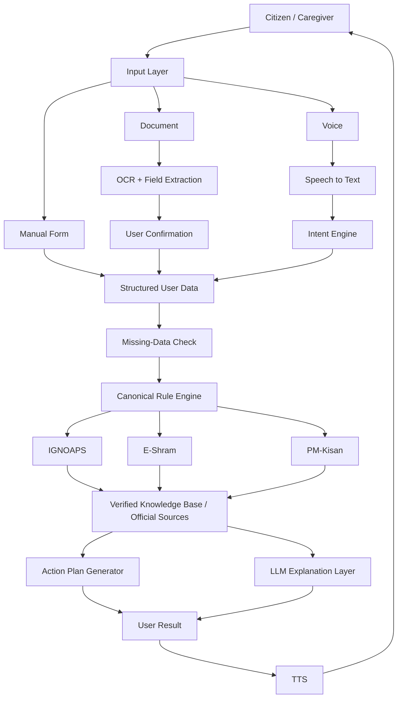
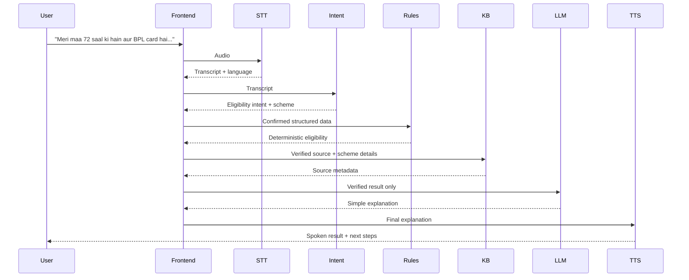

# Digital Saarthi — Repository Overview & Re-Engineering Review

> **Review date:** 25 September 2026  
> **Branch reviewed:** `main`  
> **Review method:** repository-wide static inspection of source, tests, documentation, project structure, and API contracts.  
> **Important:** this review does **not** claim that the full test suite was independently executed. The repository contains 358 test functions by static count.

---

## 1. Executive Summary

Digital Saarthi is an accessibility-first government-scheme eligibility assistant for elderly and low-literacy users. The repository contains a comparatively rich architecture: FastAPI, deterministic eligibility rules, OCR, speech-to-text, text-to-speech, intent detection, LLM explanation, action-plan generation, caching, security validation, accessibility checks, and a sizeable automated test suite.

The strongest part of the current codebase is the **policy/rule layer and component architecture**. The weakest part is **runtime integration**: the current `main.py` is not synchronized with the rest of the repository, several documented APIs are missing, and the voice/document endpoints are currently simplified/stub implementations.

### Current assessment

| Dimension | Current view |
|---|---:|
| Architecture / design maturity | **~70/100** |
| Runtime / integration readiness | **~50/100** |
| Combined engineering audit | **49/100** |
| Product concept maturity | **High** |
| Hackathon demo readiness | **Needs a focused integration pass** |

This is not a judgement on the competition outcome. It is an engineering assessment of the repository as it currently exists.

---

## 2. Product in One Sentence

**Digital Saarthi converts voice, document, or manual user input into a verified, explainable government-scheme eligibility result and actionable next steps, while keeping the deterministic rule engine in control of eligibility decisions.**

---

## 3. Current System Architecture

### Intended architecture


```mermaid
flowchart TD
    U[Citizen / Caregiver] --> I[Input Layer]
    I --> V[Voice]
    I --> D[Document]
    I --> M[Manual Form]

    V --> STT[Speech to Text]
    D --> OCR[OCR + Field Extraction]
    M --> DATA[Structured User Data]

    STT --> INTENT[Intent Engine]
    OCR --> CONFIRM[User Confirmation]
    CONFIRM --> DATA
    INTENT --> DATA

    DATA --> MISS[Missing-Data Check]
    MISS --> RULES[Canonical Rule Engine]

    RULES --> IG[IGNOAPS]
    RULES --> ES[E-Shram]
    RULES --> PK[PM-Kisan]

    IG --> SRC[Verified Knowledge Base / Official Sources]
    ES --> SRC
    PK --> SRC

    SRC --> PLAN[Action Plan Generator]
    SRC --> EXPLAIN[LLM Explanation Layer]
    PLAN --> OUT[User Result]
    EXPLAIN --> OUT
    OUT --> TTS[TTS]
    TTS --> U
```

### Actual current HTTP integration

The repository does **not yet fully realize the above architecture in the live FastAPI entry point**.

```mermaid
flowchart LR
    FE[Frontend] --> API[Current FastAPI main.py]
    API --> CHECK[/api/check-all-schemes]
    API --> DOC[/api/scan-document]
    API --> VOICE[/api/voice-upload]

    CHECK --> SR[scheme_rules.py]
    DOC --> STUB1[Simplified response]
    VOICE --> STUB2["placeholder response"]

    ORPHAN[STT / OCR / LLM / TTS / Action Plan / IntegrationService] -. implemented but not fully wired .-> API
```

**Primary architectural objective:** make the runtime path match the intended architecture before adding new technologies.

---

## 4. Repository Structure

```text
digital-saarthi-app/
├── backend/
│   ├── app/
│   │   ├── main.py
│   │   ├── models.py
│   │   ├── rule_engine.py
│   │   ├── scheme_rules.py
│   │   ├── integration_service.py
│   │   ├── intent_engine.py
│   │   ├── knowledge_base.py
│   │   ├── retrieval.py
│   │   ├── stt_service.py
│   │   ├── ocr_service.py
│   │   ├── llm_service.py
│   │   ├── tts_service.py
│   │   ├── action_plan_generator.py
│   │   ├── cache_service.py
│   │   ├── security_validator.py
│   │   ├── rate_limit_middleware.py
│   │   ├── error_handler.py
│   │   └── accessibility_validator.py
│   ├── tests/
│   └── requirements.txt
├── frontend/
│   └── index.html
└── documentation / reports
```

The repository also contains committed Python `__pycache__` / `.pyc` artifacts, which should be removed from source control.

---

# 5. Software Architect Review

## What is working well

### Separation of concerns

The repository has clear service boundaries for:

- policy/rules
- intent detection
- retrieval
- OCR
- STT
- TTS
- LLM explanation
- action plans
- caching
- security
- accessibility
- orchestration

That is a sensible decomposition for a hackathon prototype.

### Good safety boundary

The intended architecture correctly separates:

```text
Government policy + deterministic rules
            ↓
      Eligibility decision
            ↓
      LLM explanation only
```

The LLM should explain verified decisions, not create the eligibility decision.

### Canonical policy direction

`scheme_rules.py` has improved considerably. E-Shram no longer applies the old annual-income cutoff, and PM-Kisan is no longer modeled with the obsolete 2-hectare cap.

## Architectural weaknesses

### A. Application initialization is duplicated

The current `main.py` creates a FastAPI app and later creates another `FastAPI(...)` object. This can discard middleware/configuration attached to the first instance.

**Action:** create exactly one application instance.

### B. The orchestrator is not the actual API backbone

`IntegrationService` exists, but `main.py` mostly performs its own orchestration. This creates two possible architectures.

**Target:**

```text
main.py
   ↓
IntegrationService
   ↓
services + canonical rules
```

### C. Multiple policy paths

There is still potential duplication among:

- `rule_engine.py`
- `scheme_rules.py`
- `integration_service.py`
- API endpoint transformations

**Target:** policy is defined once; other layers consume it.

### D. Scalability is acceptable for the prototype

The current in-process cache and IP rate limiter are fine for a local/demo deployment. They should not be described as horizontally scalable infrastructure.

For the October 24-hour hackathon, do **not** make distributed infrastructure the priority.

---

# 6. Software Developer Review

## Strong points

- Pydantic models provide explicit API contracts.
- Error-handling utilities exist.
- Security validation exists as reusable code.
- OCR and STT have meaningful preprocessing/validation logic.
- Intent detection supports Hindi/English-oriented keywords.
- Action-plan generation is relatively detailed.
- Tests cover many individual modules.
- The code is readable enough to continue refactoring.

## Critical implementation issues

### P0: Missing API routes

The current `main.py` exposes only a small subset of the API expected elsewhere in the repository.

Current routes include:

- `GET /`
- `POST /api/check-all-schemes`
- `POST /api/scan-document`
- `POST /api/voice-upload`

The tests/documentation also expect routes such as:

- `GET /health`
- `GET /api/schemes`
- `GET /api/schemes/{scheme_id}`
- `POST /api/check-eligibility`
- `POST /api/voice-query`
- `POST /api/confirm-document`

**Action:** define one final API contract and update backend, frontend, tests, and documentation to that contract.

### P0: OCR endpoint is simplified

The current document endpoint validates the upload and then returns a simplified response rather than invoking the OCR pipeline.

**Action:** call `process_document_bytes(...)`, return its extracted fields, and preserve `needs_confirmation=True`.

### P0: Voice endpoint returns placeholder data

The current voice endpoint returns a placeholder response instead of calling `transcribe_audio(...)`.

**Action:** wire the real STT service and then call the intent engine.

### P0: Rate-limit middleware response bug

The middleware returns an `HTTPException` object instead of returning a proper HTTP response or raising the exception.

**Action:** correct middleware behavior and add an HTTP-level test for 429.

### P1: Unknown versus false

Eligibility inputs such as BPL and farmer status need three states:

```text
None  = unknown / not supplied
True  = confirmed yes
False = confirmed no
```

Do not use `False` as the default for missing eligibility facts.

### P1: Response-model synchronization

Ensure every field constructed by the API exists in the Pydantic response model, including action-plan fields.

### P1: Browser audio MIME mismatch

The frontend labels a browser-recorded Blob as WAV even though the browser may produce another codec/container.

**Action:** use the actual `MediaRecorder.mimeType` and send a matching filename/content type.

### P1: Duplicate cache method

`cache_service.py` contains repeated `get_cached_response` definitions. Keep one implementation.

### P1: Cache metric is placeholder data

`cache_hit_rate: 0.73` is not a real measurement.

**Action:** track hits/misses or remove the metric.

---

# 7. Product Manager Review

## Product strengths

### Clear target audience

The product is aimed at people who often face a high-friction government-service workflow:

- elderly users
- low-literacy users
- caregivers/helpers
- Hindi/English users

### Strong problem → feature alignment

| User problem | Product response |
|---|---|
| Difficult websites/forms | Guided workflow |
| Low literacy | Simple language |
| Language barrier | Hindi + English |
| Typing difficulty | Voice |
| Repeated document entry | OCR |
| Confusing eligibility rules | Deterministic explanation |
| "What do I do next?" | Action plans |
| Fear of incorrect advice | Official sources + rule engine |

This is a stronger product story than "an AI chatbot for schemes."

## Product weaknesses

### A. The core user journey is not fully executable

The product promise is:

```text
Speak / Scan
     ↓
Understand
     ↓
Check
     ↓
Explain
     ↓
Act
```

At the moment, the complete chain is not consistently live.

### B. Too many features for a 24-hour narrative

Do not make the presentation about every service class.

Make the product story about one complete, reliable journey.

### C. "Offline" must be defined precisely

A local frontend/cache is not the same thing as full offline AI/STT/LLM operation.

Use precise language such as:

> "The application can retain static scheme information locally and degrade gracefully when network-dependent AI services are unavailable."

Only claim true offline AI once it has actually been implemented and tested.

---

# 8. Recommended Priority Queue

## P0 — Must fix before the online round / submission build

1. **Clean `main.py` and keep one FastAPI app.**
2. **Restore the complete final API contract.**
3. **Wire real OCR.**
4. **Wire real STT.**
5. **Wire the canonical rule engine.**
6. **Wire document confirmation.**
7. **Make unknown fields explicit.**
8. **Fix rate-limit middleware.**
9. **Make the frontend call only the final API routes.**
10. **Run the complete test suite and repair failures.**

## P1 — Do immediately after P0

11. Add one true end-to-end voice test.
12. Add one true end-to-end document → confirmation → eligibility test.
13. Add source cards to the actual API response.
14. Wire action-plan generation into the real response.
15. Keep LLM explanation optional, with deterministic fallback.
16. Add actual security-header tests.
17. Run an actual browser accessibility audit.
18. Remove stale docs/claims and `__pycache__`.

## P2 — After the core works

19. Improve retrieval beyond keyword matching.
20. Add more languages.
21. Add more schemes.
22. Add persistent/distributed infrastructure only when the product actually needs it.

---

# 9. Golden User Flow

This should be the canonical demo and the canonical integration test.


```mermaid
sequenceDiagram
    participant User
    participant Frontend
    participant STT
    participant Intent
    participant Rules
    participant KB
    participant LLM
    participant TTS

    User->>Frontend: "Meri maa 72 saal ki hain aur BPL card hai..."
    Frontend->>STT: Audio
    STT-->>Frontend: Transcript + language
    Frontend->>Intent: Transcript
    Intent-->>Frontend: Eligibility intent + scheme
    Frontend->>Rules: Confirmed structured data
    Rules-->>Frontend: Deterministic eligibility
    Frontend->>KB: Verified source + scheme details
    KB-->>Frontend: Source metadata
    Frontend->>LLM: Verified result only
    LLM-->>Frontend: Simple explanation
    Frontend->>TTS: Final explanation
    TTS-->>User: Spoken result + next steps
```

### Deliberate failure test

Also demonstrate:

> "Exactly how much money will I definitely receive every month?"

The system should refuse to invent an exact universal amount when the verified data does not support one, and instead show the source/verification note.

This proves the safety architecture instead of merely describing it.

---

# 10. 48-Hour Plan Before the Online Round

## 25 September — Integration day

**Do not start another major feature.**

Finish:

- clean `main.py`
- final API routes
- real OCR endpoint
- real STT endpoint
- rule engine integration
- confirmation flow
- frontend API cleanup

Then run:

```bash
pytest tests/ -v
pytest --cov=app --cov-report=term-missing
```

Record the **actual** results.

## 26 September — Verification + online-round preparation

Morning:

- fix all failing tests
- run the app from a clean environment
- test the frontend manually
- perform one full voice flow
- perform one full document flow
- test bad input deliberately

Afternoon/evening:

- freeze the code
- prepare a 60–90 second product explanation
- rehearse the architecture
- rehearse why deterministic rules are used instead of letting the LLM decide eligibility
- revise Python/FastAPI/API/AI fundamentals relevant to your implementation
- prepare a concise explanation of OCR, STT, intent detection, rule engine, RAG/retrieval, and privacy

## 27 September — Online round

For the online assessment, prioritize **clarity and accuracy over last-minute coding changes**.

Before the assessment:

- verify the final commit
- verify the app starts
- keep one known-good demo dataset ready
- do not push risky refactors immediately before the round

The objective is to leave the round with a stable codebase, not a larger codebase.

---

# 11. Questions the Team Should Answer

Before calling the project "finished", the team should be able to answer these without opening the code:

### Architecture

1. Which component is the **single source of truth** for eligibility?
2. Why is the LLM not allowed to decide eligibility?
3. What happens when OCR is wrong?
4. What happens when STT is uncertain?
5. What happens when required data is missing?
6. What still works when the network is unavailable?

### Product

7. Who is the primary user: citizen, caregiver, CSC operator, or all three?
8. What is the one task the user must complete successfully?
9. How does the product prevent users from treating its answer as an official government approval?
10. What is the measurable user benefit: fewer steps, less reading, lower confusion, or faster eligibility discovery?

### Engineering

11. Can a fresh machine clone the repo and start the app?
12. Do frontend, backend, tests, and README all use the same API paths?
13. Does every "implemented" feature actually execute when called over HTTP?
14. Are test results real and reproducible?

---

# 12. Definition of Done

Digital Saarthi should be considered **hackathon-ready** when all of the following are true:

- [ ] One FastAPI application instance
- [ ] Final API contract frozen
- [ ] Frontend uses only final API routes
- [ ] Voice endpoint calls real STT
- [ ] Document endpoint calls real OCR
- [ ] User confirms extracted eligibility fields
- [ ] All eligibility decisions come from canonical rules
- [ ] Unknown data never becomes an implicit "No"
- [ ] Official source metadata is returned
- [ ] Action plan is returned
- [ ] LLM is explanation-only
- [ ] TTS works or fails gracefully
- [ ] Security validation is enforced
- [ ] Rate limiting is tested at HTTP level
- [ ] Full test suite passes in a clean environment
- [ ] At least two true E2E tests pass
- [ ] Browser flow has been manually tested
- [ ] README claims match the actual implementation
- [ ] No committed `__pycache__` / `.pyc` artifacts

---

# 13. Final Recommendation

**Do not add another major subsystem right now.**

The highest-value work is:

```text
             CURRENT
                │
                ▼
        Integration cleanup
                │
                ▼
        One real user journey
                │
                ▼
       Automated + manual proof
                │
                ▼
          Stable demo build
                │
                ▼
       Then consider expansion
```

The codebase already contains enough components for a compelling hackathon prototype. The next milestone is not "more AI"; it is **proving that the existing AI, policy, security, and UI layers form one coherent, runnable product.**


---

# 14. Round 2 Build Order: Detailed Engineering Plan

Round 2 should be treated as a **vertical-slice hardening sprint**, not a feature-collection sprint.

The goal is to make one complete user journey reliable, auditable, accessible, and demoable, then use the same architecture for the remaining supported schemes.

## Phase 0 — Freeze the scope

### Objective

Stop feature creep.

### Freeze the supported schemes

1. IGNOAPS
2. E-Shram
3. PM-Kisan

### Freeze the primary demo

> "Meri maa 72 saal ki hain aur BPL card hai. Unko pension mil sakti hai?"

### Freeze the secondary demo

> Upload document → review extracted information → confirm → check eligibility.

### Do not spend Round 2 time on

- Kubernetes
- microservices
- blockchain
- multi-agent systems
- large-scale vector databases
- dozens of additional schemes
- analytics dashboards unrelated to the core user journey

### Deliverable

Create a team checklist containing the exact features that are in scope and out of scope.

**Definition of done:** every team member agrees that no new feature enters the build unless it directly improves the frozen demo.

---

## Phase 1 — Repository cleanup

### Step 1: Remove generated artifacts

Remove committed:

- __pycache__/
- *.pyc
- temporary files
- local cache artifacts that should not be versioned

### Step 2: Fix .gitignore

Include Python caches, local environments, secrets, generated files, and local configuration.

### Step 3: Search for incomplete implementation

Search the repository for:

~~~text
placeholder
stub
TODO
FIXME
not implemented
legacy
hardcoded
~~~

Create a checklist for every result.

### Step 4: Reconcile documentation

Remove or correct claims such as:

- production ready
- 100% coverage
- all tests passing
- exact latency
- offline support
- cache hit rate

unless those claims are produced by an actual current test/run.

**Definition of done:** the repository documentation describes what the running application actually does.

---

## Phase 2 — Fix main.py and application startup

This is the first coding priority.

### Step 1

Keep exactly one FastAPI application instance.

### Step 2

Register CORS once.

### Step 3

Register rate limiting once.

### Step 4

Register security middleware once.

### Step 5

Register exception handlers.

### Step 6

Register all canonical API routes.

### Step 7

Add and verify /health.

### Step 8

Start the application:

~~~bash
uvicorn app.main:app --reload
~~~

### Step 9

Open the generated API documentation and manually call every endpoint.

**Definition of done:** there is exactly one running FastAPI application containing the complete intended API surface.

---

## Phase 3 — Freeze the API contract

Use one canonical API namespace.

### Required endpoints

| Method | Endpoint | Purpose |
|---|---|---|
| GET | /health | Health |
| GET | /api/schemes | Scheme list |
| GET | /api/schemes/{id} | Scheme information |
| POST | /api/check-eligibility | Single scheme |
| POST | /api/check-all-schemes | All supported schemes |
| POST | /api/voice-upload | Audio/STT |
| POST | /api/voice-query | Voice/text workflow |
| POST | /api/scan-document | OCR |
| POST | /api/confirm-document | Confirm extracted data |

### For each endpoint

1. Define request model.
2. Define response model.
3. Implement endpoint.
4. Connect service.
5. Update frontend.
6. Update tests.
7. Remove old endpoint names.
8. Test manually.
9. Add an integration test.

**Definition of done:** frontend, backend, tests, and documentation all use exactly the same route names and schemas.

---

## Phase 4 — Fix data-model semantics

### Problem

Eligibility fields currently risk collapsing "unknown" into "false".

### Target

Use three-state semantics:

~~~text
True  = confirmed yes
False = confirmed no
None  = unknown
~~~

Example:

~~~python
has_bpl: Optional[bool] = None
is_farmer: Optional[bool] = None
is_organised_worker: Optional[bool] = None
land_holding_hectares: Optional[float] = None
~~~

### Step-by-step

1. Update Pydantic models.
2. Update frontend request payloads.
3. Update rule functions.
4. Update missing-data detection.
5. Add tests for True/False/None.
6. Ensure missing data produces cannot_determine or a clarification question.

**Definition of done:** no eligibility rule can interpret an unanswered question as a confirmed negative.

---

## Phase 5 — Make the rule engine the single source of truth

### Target flow

~~~text
API
 ↓
Integration Service
 ↓
Rule Engine
 ↓
scheme_rules.py
 ↓
Structured Result
~~~

### Step-by-step

1. Remove eligibility decisions from main.py.
2. Remove duplicate policy decisions from integration code.
3. Keep scheme-specific rules in scheme_rules.py.
4. Make rule_engine.py the public decision interface.
5. Return a structured result containing:
   - scheme
   - verdict
   - reasons
   - missing fields
   - confidence/decision state
   - source metadata
6. Add boundary tests.

### Required verdicts

~~~text
eligible
not_eligible
cannot_determine
invalid_input
~~~

**Definition of done:** every eligibility decision can be traced to one canonical rule function.

---

## Phase 6 — Policy verification

For each supported scheme, create a policy record containing:

- official source URL
- source/department
- verification date
- eligibility rules
- exclusions
- benefit information
- required evidence
- application/action information
- uncertainty conditions

### Step-by-step

1. Open the authoritative official source.
2. Record the exact current conditions.
3. Compare them with scheme_rules.py.
4. Correct outdated assumptions.
5. Add boundary tests.
6. Add source metadata to the result.
7. Display source information in the UI.

### Important checks

- Do not use the obsolete simplistic PM-Kisan "2 hectare" rule as the complete eligibility model.
- Do not infer BPL status merely from the existence of a generic ration card.
- Do not present a benefit amount as universal unless the current source supports that exact claim.
- If official sources differ, document the discrepancy instead of silently choosing one.

**Definition of done:** every eligibility statement shown to the user has a traceable source.

---

## Phase 7 — Real OCR pipeline

### Backend pipeline

~~~text
Upload
 ↓
File validation
 ↓
Image preprocessing
 ↓
Tesseract
 ↓
Field extraction
 ↓
Field confidence
 ↓
PII sanitization
 ↓
needs_confirmation = true
 ↓
Frontend confirmation
~~~

### Frontend pipeline

~~~text
Upload
 ↓
"We found these details"
 ↓
User edits if necessary
 ↓
User confirms
 ↓
Eligibility evaluation
~~~

### Required OCR tests

- valid document
- invalid MIME
- invalid file signature
- corrupt image
- low-confidence OCR
- missing age
- ambiguous BPL
- PII cleanup
- large document
- unreadable document

**Definition of done:** document upload can complete the full OCR → confirmation → eligibility flow without bypassing confirmation.

---

## Phase 8 — Real STT pipeline

### Step-by-step

1. Record audio using the browser's actual MIME type.
2. Do not label WebM/Opus bytes as WAV.
3. Validate audio server-side.
4. Transcribe.
5. Detect language.
6. Detect silence.
7. Extract intent/entities.
8. Show the transcript.
9. Ask for confirmation when the transcription is important.
10. Continue to the rule engine only after required information is confirmed.

### User experience

~~~text
I heard:

"Meri maa 72 saal ki hain aur BPL card hai."

[Confirm] [Edit]
~~~

### Confidence requirement

If confidence is heuristic rather than model-calibrated, label it as estimated confidence or do not expose a misleading percentage.

**Definition of done:** a real audio file produces a real transcript and enters the same canonical pipeline as manual input.

---

## Phase 9 — Missing-data and clarification engine

This should become a visible product feature rather than an internal implementation detail.

### Example

~~~text
User:
"My mother is 72."

System:
"I can check pension eligibility, but I need to know whether
she is registered as BPL."

[Yes] [No] [I'm not sure]
~~~

### Step-by-step

1. Determine the selected scheme.
2. Determine required fields.
3. Compare required fields with known fields.
4. Ask only for missing required information.
5. Store the answer in the structured request.
6. Re-run the rule engine.
7. Stop when a safe verdict is possible.

**Definition of done:** the system can recover from incomplete user input without guessing.

---

## Phase 10 — Action-plan generation

Do not stop at an eligibility verdict.

Generate:

~~~text
Result
 ↓
Why
 ↓
Required documents
 ↓
Where to apply
 ↓
What to do next
 ↓
Official source
~~~

### Rules

Action-plan items must come from verified knowledge.

The system must not invent:

- documents
- fees
- offices
- deadlines
- application steps

**Definition of done:** every result includes a useful next step or an explicit explanation of what information is still missing.

---

## Phase 11 — LLM explanation layer

Only activate the LLM after the deterministic result exists.

### Input

Structured verified result.

### LLM is allowed to

- simplify
- translate
- summarize
- explain
- organize verified next steps

### LLM is not allowed to

- change verdict
- create policy
- invent a benefit
- invent a source
- claim successful application
- fill missing eligibility evidence

### Failure fallback

~~~text
LLM unavailable
     ↓
Rule result
     +
Template explanation
     +
Official source
~~~

**Definition of done:** the application remains useful even if the LLM service is unavailable.

---

## Phase 12 — TTS

### Step-by-step

1. Produce final verified text.
2. Select language.
3. Generate speech.
4. Return/play audio.
5. Keep text visible as a fallback.

### Test

- Hindi
- English
- elderly-friendly slower speech
- long responses
- TTS provider failure

**Definition of done:** TTS is an enhancement, not a single point of failure.

---

## Phase 13 — Security hardening

Test the application over HTTP, not only individual helper functions.

### Upload tests

- oversized file
- wrong MIME
- wrong magic bytes
- malicious filename
- corrupt file

### API tests

- malformed JSON
- invalid field values
- oversized requests
- repeated requests/rate limit
- unauthorized access if authentication is later added
- timeout/error handling

### Privacy checks

~~~text
No raw PII in logs
No unnecessary document persistence
Temporary files cleaned
No stack traces returned to users
Sensitive identifiers masked
~~~

### Middleware check

Keep one authoritative rate-limit mechanism.

**Definition of done:** security controls are observable in real HTTP behavior.

---

## Phase 14 — Accessibility and elderly-first UX

### Keyboard

Test the entire journey:

~~~text
Tab
 ↓
Speak
 ↓
Upload
 ↓
Confirm
 ↓
Result
 ↓
Next step
~~~

### Screen reader

Check:

- labels
- headings
- buttons
- status updates
- errors
- result announcements

### Visual

Check:

- contrast
- readable typography
- visible focus
- mobile layout
- touch target size

### Cognitive accessibility

Avoid:

- policy-heavy paragraphs
- unexplained abbreviations
- multiple questions at once
- hidden error states

**Definition of done:** a user can complete the main journey without needing to understand technical or bureaucratic terminology.

---

## Phase 15 — Frontend polish

Implement five clear states.

### State 1: Home

~~~text
How can I help you?

[Speak]
[Upload document]
[Type]
~~~

### State 2: Listening

~~~text
Listening...
~~~

### State 3: Confirmation

~~~text
I understood:

Age: 72
BPL: Yes

[Confirm]
[Edit]
~~~

### State 4: Result

~~~text
IGNOAPS

Result
Why
Documents
What to do
Official source
~~~

### State 5: Uncertainty

~~~text
I need one more detail.

Is the person registered as a BPL beneficiary?

[Yes]
[No]
[I'm not sure]
~~~

**Definition of done:** users always know what the system is doing and what action is expected next.

---

## Phase 16 — Full E2E testing

Do not stop at unit tests.

### Golden path

~~~text
Voice
 ↓
STT
 ↓
Intent
 ↓
Missing data
 ↓
Confirmation
 ↓
Rule
 ↓
Source
 ↓
Action plan
 ↓
LLM
 ↓
TTS
~~~

### OCR path

~~~text
Document
 ↓
OCR
 ↓
Confirmation
 ↓
Rule
 ↓
Result
~~~

### Manual path

~~~text
Form
 ↓
Rule
 ↓
Result
~~~

### Failure path

~~~text
Bad input
 ↓
Safe error
 ↓
Recovery option
~~~

At minimum, create real browser/API tests for the happy voice/manual path and the OCR confirmation path.

---

## Phase 17 — Performance measurement

Measure before optimizing.

Record:

- API latency
- STT latency
- OCR latency
- rule-engine latency
- LLM latency
- TTS latency
- total response time
- cache hit rate
- cache miss rate

Do not publish hard-coded numbers.

The rule engine should be fast enough that external services dominate the latency profile.

---

## Phase 18 — Privacy verification

Run a final privacy audit:

- [ ] Raw documents are not unnecessarily persisted.
- [ ] OCR text is not unnecessarily logged.
- [ ] Aadhaar-like identifiers are masked.
- [ ] Temporary files are cleaned.
- [ ] Exceptions do not expose stack traces.
- [ ] Cache does not retain unnecessary PII.
- [ ] API responses contain only required information.

---

## Phase 19 — Judge demo engineering

Build exactly two demonstrations.

### Demo A — Happy path

User:

> "Meri maa 72 saal ki hain aur BPL card hai. Unko pension mil sakti hai?"

Show:

~~~text
Voice
 ↓
Transcript
 ↓
Confirmation
 ↓
IGNOAPS
 ↓
Deterministic result
 ↓
Official source
 ↓
Action plan
 ↓
Hindi explanation / TTS
~~~

### Demo B — Deliberate uncertainty

Give insufficient information.

Expected behavior:

~~~text
I need one more detail before I can determine this.
~~~

This is valuable because it proves the system does not simply guess.

### Demo C — Optional failure fallback

Temporarily disable/mock the LLM and show:

~~~text
Rule result
 ↓
Template explanation
 ↓
Official source
~~~

This proves the product does not collapse when an external AI service fails.

---

## Phase 20 — Presentation evidence

Prepare:

### Slide 1: Problem
Why elderly/low-literacy users struggle with government-service information.

### Slide 2: Solution
Voice + documents + verified rules + action plan.

### Slide 3: Architecture
One clean system diagram.

### Slide 4: Safety
~~~text
AI understands
      ↓
Rules decide
      ↓
Sources verify
      ↓
AI explains
~~~

### Slide 5: Live demo
Use the happy path.

### Slide 6: Failure/uncertainty
Show the system refusing to guess.

### Slide 7: Measured impact
Use actual user-testing results only.

Never invent adoption, accuracy, latency, or impact numbers.

---

## Phase 21 — Final freeze

Run:

~~~bash
pytest -q
pytest --cov=app --cov-report=term-missing
uvicorn app.main:app --host 0.0.0.0 --port 8000
~~~

Then manually test:

- [ ] Voice
- [ ] Document
- [ ] Manual input
- [ ] Hindi
- [ ] English
- [ ] Missing data
- [ ] Invalid upload
- [ ] STT failure
- [ ] OCR failure
- [ ] LLM failure
- [ ] TTS failure
- [ ] Mobile layout
- [ ] Keyboard navigation

Create backups:

- Git repository
- ZIP
- demo machine
- sample audio
- sample document
- .env.example
- offline/demo fallback assets

---

# 17. Round 2 definition of done

The project is Round-2 ready when:

- [ ] One FastAPI application instance
- [ ] Canonical API contract
- [ ] No placeholder responses
- [ ] Real OCR endpoint
- [ ] Real STT endpoint
- [ ] OCR confirmation enforced
- [ ] Unknown values remain unknown
- [ ] One canonical rule engine
- [ ] Official policy sources verified
- [ ] Source attribution visible
- [ ] Action plans use verified information
- [ ] LLM is explanation-only
- [ ] TTS works or has fallback
- [ ] Frontend uses canonical endpoints
- [ ] Browser audio MIME handling is correct
- [ ] Security validation tested through HTTP
- [ ] Rate limiting tested
- [ ] PII-safe logging verified
- [ ] Generated artifacts removed from Git
- [ ] Tests actually executed
- [ ] Coverage measured
- [ ] At least one genuine browser E2E flow
- [ ] Hindi voice demo works
- [ ] Document demo works
- [ ] Uncertainty demo works
- [ ] External-AI failure has a deterministic fallback
- [ ] Documentation matches actual runtime

---

# 18. Team questions

Before calling the project finished, the team should be able to answer:

1. Which government source wins when two official pages disagree?
2. What happens when OCR confidence is low?
3. What happens when speech is unclear?
4. What happens when the user gives contradictory information?
5. Which fields are mandatory for each scheme?
6. Can a result be eligible when a required field is unknown?
7. Where exactly is the final decision made?
8. Can the LLM change that decision?
9. What personal information is stored?
10. How long is it retained?
11. What happens when the LLM/API is unavailable?
12. What happens when internet connectivity is lost?
13. Can a caregiver operate the system for another person?
14. How is "not eligible" distinguished from "cannot determine"?
15. How will you demonstrate actual user benefit?

---

# 19. Priority matrix

| Priority | Work | Reason |
|---|---|---|
| P0 | Fix main.py | Core runtime |
| P0 | Remove OCR/STT stubs | Live demo |
| P0 | Unify API | Frontend/backend correctness |
| P0 | Canonical rule engine | Eligibility correctness |
| P0 | Unknown ≠ false | Safety |
| P0 | Verify policy sources | Credibility |
| P1 | OCR confirmation | Trust |
| P1 | STT confirmation | Voice reliability |
| P1 | E2E testing | Proof |
| P1 | Frontend polish | UX |
| P1 | Security testing | Safety |
| P1 | TTS | Accessibility |
| P2 | Semantic/vector retrieval | Enhancement |
| P2 | More schemes | Scope expansion |
| P2 | Analytics/dashboard | Non-core |
| P2 | Kubernetes/microservices | Unnecessary for current hackathon stage |

---

# 20. Final engineering direction

~~~text
                    DIGITAL SAARTHI

       Voice ─────┐
                  │
       Document ──┼──→ UNDERSTANDING
                  │
       Manual ────┘
                       ↓
                  CONFIRMATION
                       ↓
               DETERMINISTIC RULES
                       ↓
                VERIFIED POLICY
                       ↓
             ┌─────────┴─────────┐
             ↓                   ↓
        ACTION PLAN         EXPLANATION
             │                   │
             └─────────┬─────────┘
                       ↓
                 HINDI / ENGLISH
                       ↓
                  TEXT / VOICE
                       ↓
                      USER
~~~

### Engineering principle

> **Do not make Digital Saarthi smarter before making it more coherent.**

The repository already contains most of the ingredients. Round 2 should connect them into **one reliable, auditable, judge-ready vertical slice**.

### Round-2 execution order

**Freeze scope → clean repo → fix runtime → unify API → fix data models → centralize rules → verify policy → real OCR → real STT → confirmation → action plans → LLM guardrails → TTS → security → accessibility → E2E → demo → final freeze.**
